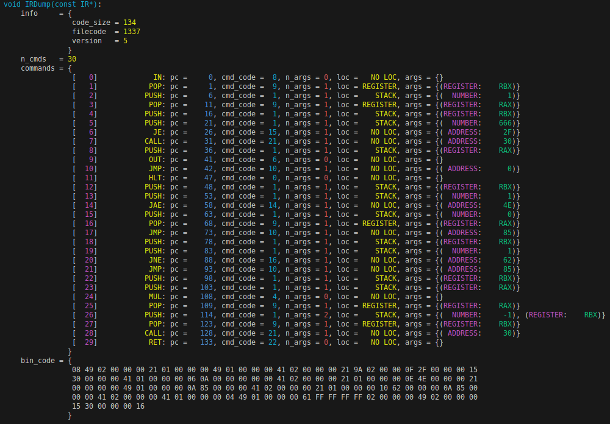
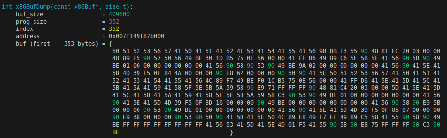

# Бинарный транслятор

В данном проекте мной был создан компилятор для собственного диалекта ассемблера, который транслирует программы, написанные на этом языке, в исполняемый машинный код архитектуры Intel x86-64.

## Принципы работы

Начальной стадией является написание программы на языке программирования "Kryuzhovnik" (ссылка на repo)

### Программа на диалекте ассемблера

Диалект ассемблера (ссылка на repo) повзоляет написать программу.

### Промежуточное представление (IR)

Представление программы в описанном бинарном файле сложно напрямую транслировать в код на x86-64. Поэтому используется промежуточное представление (IR) - структура данных, содержащая всю информацию об исполняемой программе:

```C++
    struct IR
    {
        TechInfo    info    ;
        BYTE*       bin_code;
        Command*    commands;
        size_t      n_cmds  ;
    };
```

Каждая команда в массиве ``commands`` также является структурой, содержащей информацию о своём типе, аргументах:

```C++
    struct Command
    {
        size_t       pc      ;
        int          cmd_code;
        size_t       n_args  ;
        Argument     args[2] ;
        ArgLocation  loc     ;
    };
```

Таким образом, после обработки парсером в IR программа имеет следующий вид:



### Трансляция в исполняемый бинарный код x86-64

После этого, полученная более удобная для трансляции форма переводится в буфер с командами x86, хранящийся в следующей структуре данных:

```C++
    struct x86Buf
    {
        BYTE*   buf      ;
        size_t  buf_size ;
        size_t  prog_size;
        size_t  index    ;
    };
```

Этим и занимается бинарный транслятор, ниже представлены примеры трансляции команд моего диалекта ассемблера в блоки инструкций x86-64:

- PUSH

    PUSH num:
    ```
        mov r14, <num>
        push r14
    ```

    PUSH reg:
    ```
        push <reg>
    ```

    PUSH [reg]:
    ```
        push <reg>
        pop r13
        mov r14, [rbp + r13 * 8]
        push r14
    ```

    PUSH [num]:
    ```
        push <num>
        pop r13
        mov r14, [rbp + r13 * 8]
        push r14
    ```

    PUSH [num+reg]:
    ```
        push <num>
        push <reg>
        pop r13
        pop r14
        add r13, r14
        mov r14, [rbp + r13 * 8]
        push r14
    ```

- POP

    POP reg:
    ```
        pop <reg>
    ```

- ADD

    ```
    pop  r13
    pop  r14
    add  r13, r14
    push r13
    ```

- SUB

    ```
    pop  r13
    pop  r14
    sub  r13, r14
    push r13
    ```

- MUL (знаковое умножение целых чисел)

    ```
    pop  r13
    pop  r14
    push rax
    mov  rax, r13
    imul r14
    mov  r13, rax
    pop  rax
    push r13
    ```

- FMUL (знаковое умножение вещественных чисел)

    ```
    push  1000
    fild  qword [rsp+16]
    fild  qword [rsp+8]
    fild  qword [rsp]
    fdiv
    fmul
    add   rsp, 16
    fistp qword [rsp]
    ```

- DIV (целочисленное деление знаковых чисел))

    ```
    push  1000
    fild  qword [rsp+16]
    fild  qword [rsp+8]
    fild  qword [rsp]
    fdiv
    fmul
    add   rsp, 16
    fistp qword [rsp]
    ```

- FDIV (знаковое деление вещественных чисел)

    ```
    pop  r14
    pop  r13
    push rax
    push rdi
    mov  rax, r13
    idiv r14
    mov  r13, rax
    pop  rdi
    pop  rax
    push r13
    ```

- FABS (модуль числа)

    ```
    fild qword [rsp]
    fabs
    fistp qword [rsp]
    ```

- FSQRT (квадратный корень)

    ```
    push 1000
    fild qword [rsp]
    fild qword [rsp+8]
    fild qword [rsp]
    add rsp, 8
    fdiv
    fsqrt
    fmul
    fistp qword [rsp]
    ```

- JMP (безусловный переход)
- Jxx (условный переход)
- CALL
- RET
- IN

```
    push rdi
    push rax
    push rsi
    mov  r14, <InCmd_address>
    call r14
    mov  r14, rax
    push rsi
    push rax
    push rdi
    push r14
```
    , где InCmd - написанная на C функция, определённая в файле выше:
```C++
    long int InCmd()
    {
        long int num = 0;
        printf("Type a number: ");
        scanf("%ld", &num);
        return num;
    }
```

- OUT

```
    pusha
    pop  r14
    mov  rdi, r14
    mov  r14, %p
    call r14
    popa
```
    , где OutCmd - написанная на C функция, определённая в файле выше:
```C++
    void OutCmd(long int num)
    {
        printf("OUT: %ld\n", num);
    }
```
- PRINT

Оперативная память процессора выделяется в начале трансляции, на RAM выделено 800 байт памяти (100 яеек размера 8).

В результате итеративной обработки массива команд из IR буфер ``x86_buf`` заполняется байтами:



## Оценка производительности

Сравним скорости исполнения программы на собственном эмуляторе процессора и на реальном процессоре при её бинарной трансляции. Измерения производительности будем проводить на программе, считающей факториал числа 10 10000 раз. Результаты измерений приведены ниже:

    t_CPU = 2.20  c
    t_x86 = 75.70 с

Таким образом, ускорение программы за счёт бинарной трансляции в код на x86-64 составило около **75.70/2.20 ~ 34.4**, эти цифры оправдывают JIT-компиляцию.
